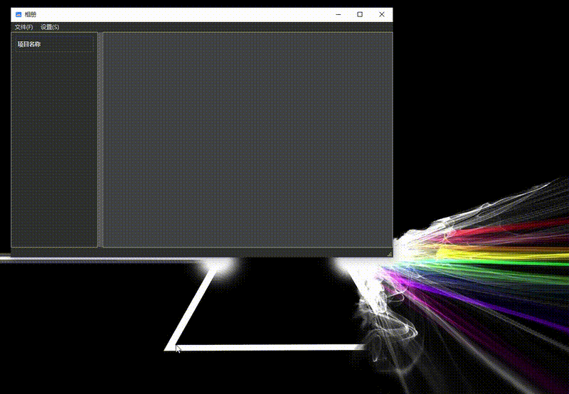
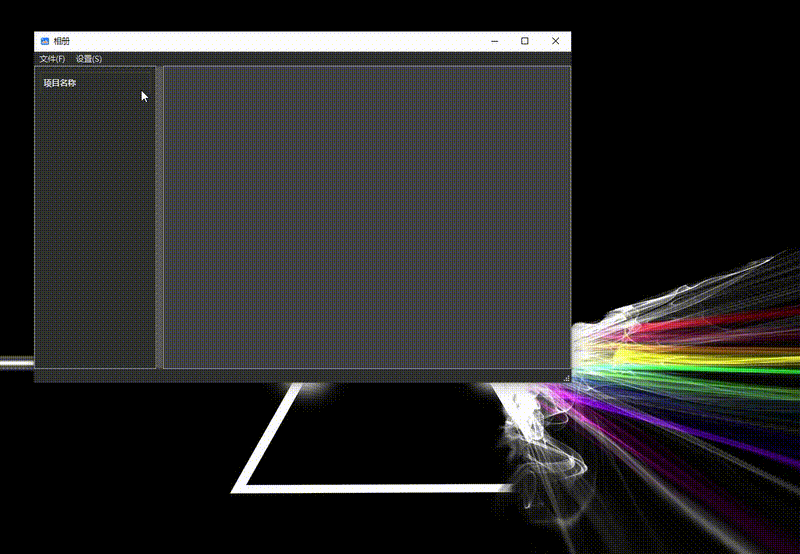

## Qt 相册浏览系统

一个基于 **C++17** 与 **Qt 6** 开发的跨平台图像浏览器，支持相册树状导航、图像自适应缩放、背景音乐播放与主题切换。界面美观，结构清晰，适用于教学演示或作为桌面项目模板。

### 功能亮点

- **树状导航栏**  
  使用 `QTreeView` + `QFileSystemModel` 展示文件夹结构，实现相册级联浏览

- **图像自适应显示**  
  响应窗口大小变化，自动缩放图片，确保用户最佳观看体验

- **幻灯片播放**  
  支持自动切换图片，带有播放控制，方便用户无干扰欣赏相册内容

- **背景音乐播放**  
  使用 `QMediaPlayer` + `QMediaPlaylist` 支持本地音乐循环播放与控制

- **界面主题切换**  
  通过加载外部 QSS 文件支持主题定制与 UI 美化

- **跨平台构建支持**  
  使用 `CMake` 构建系统，可在 Windows / Linux 平台编译运行

### 技术栈

- **编程语言：** C++17  
- **框架工具：** Qt 6（Widgets / Multimedia）  
- **构建工具：** CMake  
- **开发环境：** Qt Creator

### 示例截图

#### 创建项目

- 创建项目时有校验
- 关闭项目时可以把复制到项目下的文件一同删除

#### 打开项目

- 关闭项目不会删除本地文件

#### 幻灯片播放

- 幻灯片播放会和背景音乐同步
- 可以随时暂停播放，手动点击下一页，或者点击下方预览项

### 项目构建

使用 Qt Creator 打开运行

1. 打开 Qt Creator，选择 `CMakeLists.txt` 项目文件  
2. 配置编译环境（Qt 6 + C++17）  
3. 编译并运行